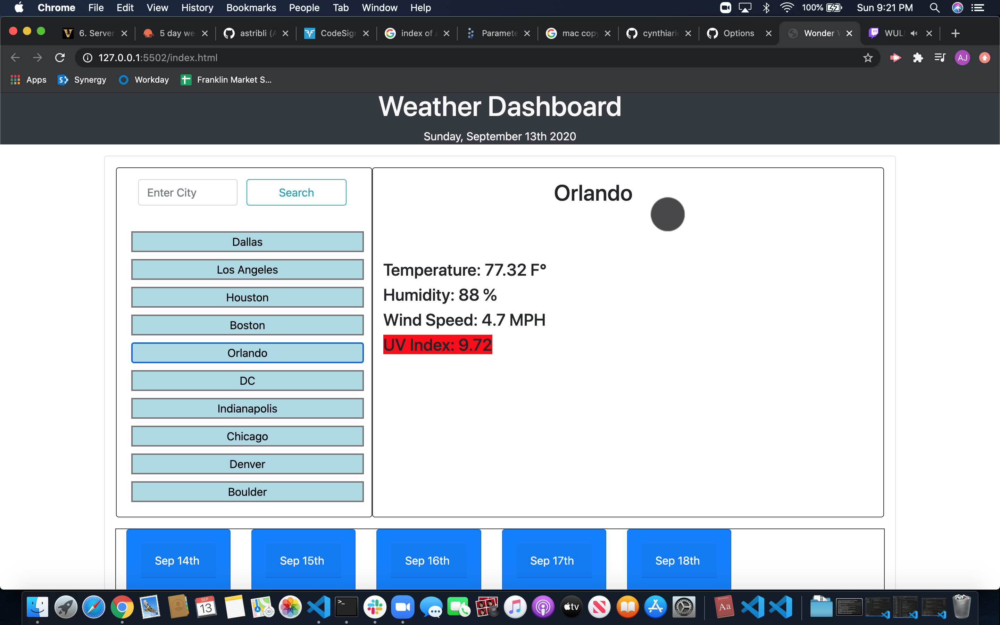

# My Weather Dashboard

A simple web-app that allows you to search for a city and get the current weather and 5 day forecast. You can experience the deployed project here: https://astribli.github.io/weather-dashboard/

Screenshot of deployed app

## Usage
1. Simply type the name of the city in the field provided and click the search button.
2. You can also select from the list of cities previously searched to see an up-to-date forecast.
## Tools Used
- OpenWeather's Current Weather and 5 day forecast APIs
- Bootstrap
- Moment.js
## Future Iteration
Future opportunities for improvement include:

- Better icons for weather conditions
- Include more detailed weather information (both current and forecast)
- Include historical data (average temps per day, etc)